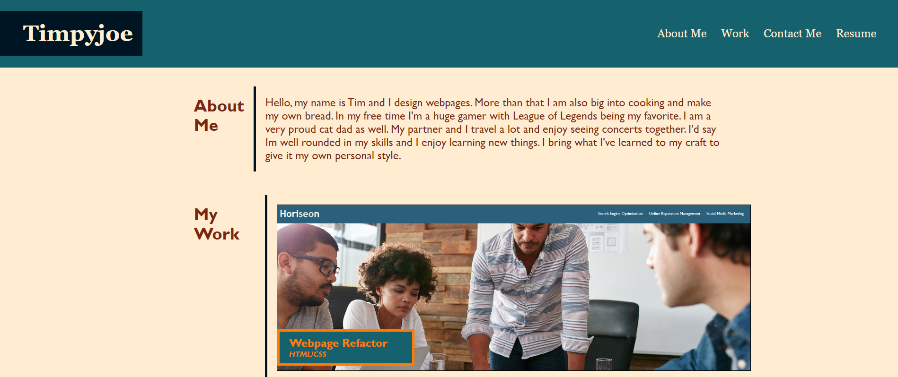

# Portfolio Page

## Description

This project was created as a way to build a portfolio page that can be shown to potential employers to showcase my abilities. The webpage was built completely from scratch using both HTML and CSS. While I have yet to master the more advanced techniques of the languages, this project conveys that I have a fundamental understanding of them and how they interact. The project contains mostly placeholders currently, but will continually be updated with more real projects as they are completed. The webpage should be completely interactive and responsive to variously sized viewports. 

## Usage

This project can be accessed by going to [this page.](https://timpyjoe.github.io/portfolio-)

Below is a screenshot of what the page should look like.

## Credits

CSS Reset file courtesy of [Eric Meyer](http://meyerweb.com/eric/tools/css/reset/ )
--v2.0 | 20110126
   License: none (public domain)

Stock Photos courtesy of [Luca Bravo](https://unsplash.com/photos/XJXWbfSo2f0?utm_source=unsplash&utm_medium=referral&utm_content=creditCopyText), 
[Marvin Meyer](https://unsplash.com/photos/SYTO3xs06fU?utm_source=unsplash&utm_medium=referral&utm_content=creditCopyText),
[Adem AY](https://unsplash.com/photos/Tk9m_HP4rgQ?utm_source=unsplash&utm_medium=referral&utm_content=creditCopyText),
and [Pawel Nolbert](https://unsplash.com/photos/timelapse-photography-of-vehicles-and-buildings-4u2U8EO9OzY?utm_source=unsplash&utm_medium=referral&utm_content=creditCopyText) via 
[Unplash.com](https://www.unsplash.com)

---
